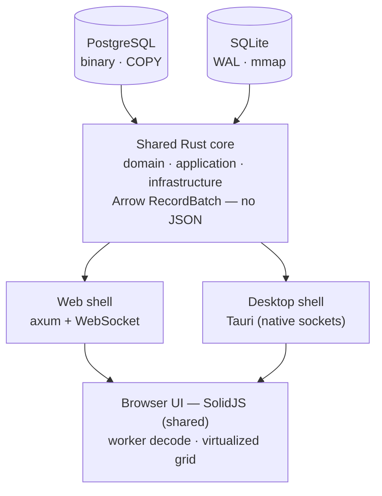

# Architecture — 1 Core, 2 Shells

> [!abstract] ใจความเดียว
> เขียน **Rust core + SolidJS UI ครั้งเดียว** แล้วห่อออกเป็น 2 ร่าง: **web** (สะดวก แก้ง่าย) และ **desktop** (เร็วสุดขีด) ไม่ต้องเลือกอย่างใดอย่างหนึ่ง

## ภาพรวม

## สองร่าง ต่างกันยังไง

| | Web shell (ร่างสะดวก) | Desktop shell (ร่างเร็วสุด) |
|---|---|---|
| ห่อด้วย | `axum` + WebSocket | Tauri (core in-process) |
| เส้นทางข้อมูล | browser → WS → backend → DB | webview → loopback/IPC → core → DB |
| จุดเด่น | เปิด URL ไม่ต้องติดตั้ง, iterate ไว, debug ง่าย | ไม่มี network hop, ต่อ socket ตรง, ปลดล็อก mmap snapshot / WAL rescue |
| ใช้ตอน | dev loop หลัก + แชร์ลิงก์ | release ที่ต้องการ throughput/latency สูงสุด |

## ของจริงที่ต้องยอมรับ (ฟิสิกส์ ไม่ใช่ข้อออกแบบ)

> [!warning] browser เปิด TCP ตรงไป Postgres ไม่ได้
> เวอร์ชัน browser จึง **ต้องมี Rust backend ถือ connection เสมอ** (รันบน server หรือรันเป็น daemon บนเครื่องตัวเองแล้วเปิด `127.0.0.1`) ส่วน desktop (Tauri) core อยู่ใน process เดียวกับ UI → ต่อ DB ตรงและเร็วกว่า = เหตุผลที่ desktop เป็น "ร่างเร็วสุด" โดยธรรมชาติ

## เคล็ดทำให้ desktop เร็วสุดแต่ reuse โค้ด 100%
> [!tip]
> ให้ Tauri รัน axum ตัวเดิม bind `127.0.0.1` ใน process แล้ว webview ต่อผ่าน loopback WS (เร็วระดับ GB/s, latency แทบศูนย์) — เริ่มแบบนี้ก่อน แล้วค่อยอัป "เต็มขีด" ด้วย Tauri custom protocol ส่ง Arrow bytes ดิบโดยไม่ serialize ดู [[M6 - Desktop Shell (Tauri)]]

ต่อไป: [[Hot Path - Arrow Everywhere]] · [[Tech Stack]] · [[Clean Architecture Layer Map]]
