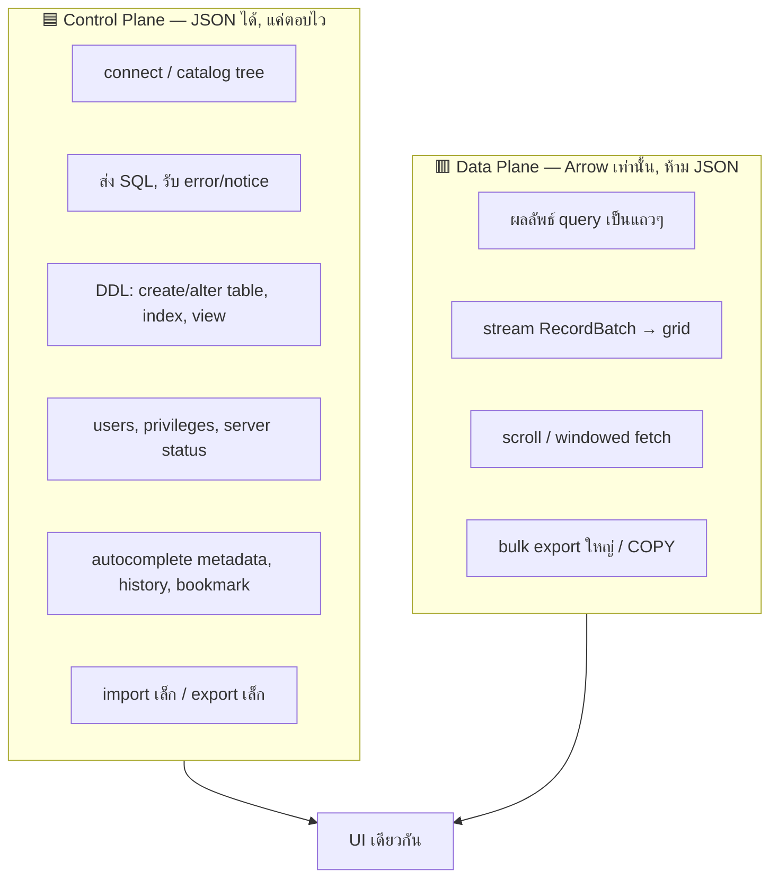

# Data Plane vs Control Plane — กุญแจที่ทำให้เพิ่ม 100 ฟีเจอร์ได้โดยไม่ช้า

> [!important] ใจความเดียวที่ต้องจำ
> DataM มี **2 ระนาบ** ที่กฎความเร็วต่างกันคนละโลก ถ้าแยกสองอันนี้ออกจากกันชัดเจน คุณจะยัดฟีเจอร์ของ DataGrip + phpMyAdmin เข้ามาได้ทั้งหมดโดยที่ hot path ยัง "ศักดิ์สิทธิ์" และเร็วเท่าเดิม

## สองระนาบ

| | 🟦 Control Plane | 🟥 Data Plane (hot path) |
|---|---|---|
| ขนส่งอะไร | คำสั่ง, metadata, schema, error, สถานะ | **row data** ปริมาณมาก |
| รูปแบบ | **JSON ได้** (เล็ก, นานๆ ที) | **Arrow IPC เท่านั้น** ([[Hot Path - Arrow Everywhere]]) |
| เป้าความเร็ว | "รู้สึกทันที" (< 50–100ms ก็พอ) | 1M rows, 60fps, p95 < 100ms ([[Performance Budget]]) |
| ปริมาณฟีเจอร์ | **~90% ของฟีเจอร์ทั้งหมดอยู่นี่** | น้อยมาก แต่คือหัวใจ |
| แก้ผิดแล้ว | แค่ช้านิดหน่อย ไม่มีใครตาย | perf พังทันที = โปรเจกต์ตาย |

> [!success] ทำไมเรื่องนี้สำคัญกับคำถาม "เร็วที่สุด"
> DataGrip/phpMyAdmin features ส่วนใหญ่ (catalog, DDL editor, users, history, ER diagram, import เล็ก) คือ **control plane** ทั้งนั้น มันไม่เคยแตะ hot path เลย → คุณเพิ่มได้ไม่อั้นโดยที่ความเร็วการ scroll ตาราง 1M แถวไม่ขยับแม้แต่นิดเดียว **เร็ว = ปกป้อง data plane ให้บางและบริสุทธิ์ ส่วนที่เหลือเขียนสบายๆ**

## กฎ 3 ข้อของการแยกระนาบ

> [!check] 1. row data วิ่งบน data plane เท่านั้น
> อะไรที่เป็น "เซลล์ในตารางผลลัพธ์" = Arrow เสมอ ([[Iron Rules]] ข้อ 2)

> [!check] 2. ทุกอย่างที่เหลือ = control plane = JSON ไม่ต้องคิดมาก
> create table, ดู DDL, list users, query history, error message — JSON เล็กๆ เขียนเร็ว debug ง่าย ปล่อยให้ง่ายไว้ อย่า over-engineer

> [!check] 3. endpoint แยกกันชัด
> control plane = `POST /cmd`, `GET /catalog`, `POST /ddl` (JSON) · data plane = `GET /ws` (binary Arrow) — คนละ route คนละ mindset

## ตารางสรุป: ฟีเจอร์ไหนอยู่ระนาบไหน

| Epic | ระนาบ | หมายเหตุ |
|---|---|---|
| [[F01 - Connections and Data Sources]] | 🟦 control | |
| [[F02 - Object Explorer]] | 🟦 control | |
| [[F03 - SQL Editor]] | 🟦 control | (ตัว editor) — ผลลัพธ์ที่รันคือ 🟥 |
| [[F04 - Result Grid]] | 🟥 **data** | หัวใจความเร็ว ([[M3 - Virtualized Grid]]) |
| [[F05 - Data Editing and Transactions]] | 🟦+🟥 | อ่าน=data, เขียน=control (UPDATE เล็ก) |
| [[F06 - Schema and DDL Management]] | 🟦 control | |
| [[F07 - Import and Export]] | 🟦 เล็ก / 🟥 ใหญ่ | export 1GB = data plane streaming |
| [[F08 - Visual Tools]] | 🟦 control | ERD, query builder, explain |
| [[F09 - Search and Navigation]] | 🟦 control | ผลค้นหาเยอะ → 🟥 |
| [[F10 - Admin and Server]] | 🟦 control | |
| [[F11 - Productivity and Safety]] | 🟦 control | |
| [[F12 - Desktop Superpowers]] | 🟥 + native | mmap, WAL rescue |

ดูภาพรวมระนาบใหญ่ที่ [[Architecture - 1 Core 2 Shells]] · รายการฟีเจอร์ทั้งหมด [[Feature Catalog]]
