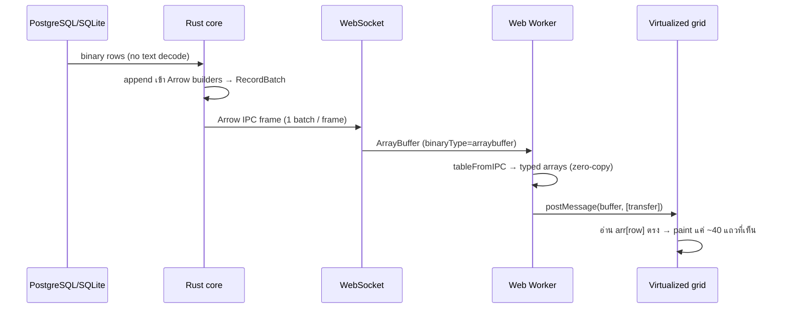

# Hot Path — Arrow Everywhere

> [!important] กฎข้อเดียวที่ตัดสินว่าจะได้ 1M rows ที่ 60fps จริงหรือไม่
> ใช้ **Apache Arrow IPC ตลอดเส้นทาง DB → backend → browser** และ **ห้าม JSON บน row data เด็ดขาด**

## เส้นทางข้อมูล (data path)

## ทำไม Arrow ไม่ใช่ JSON
> [!danger] JSON = ตาย
> `JSON.parse` 1M แถว = วินาที + สร้าง object ต่อ cell หลายล้านตัว → GC ตาย ตัดทิ้งทันที JSON ใช้ได้เฉพาะ control plane เล็กๆ (login, ส่ง SQL, schema, error)

- คอลัมน์ตัวเลข decode ออกมาเป็น `Float64Array`/`Int32Array` **ตรงๆ** → grid อ่าน `arr[row]` ไม่มี allocation ต่อ cell
- ฝั่ง Rust: `arrow-rs` → `StreamWriter`
- ฝั่ง browser: `apache-arrow` JS → `tableFromIPC` / `RecordBatchReader`
- คอลัมน์ string: เก็บเป็น offsets buffer + data buffer → `TextDecoder` เฉพาะ cell ที่มองเห็น (lazy)

## เทคนิคที่ต้องมีคู่กัน
- [ ] **backpressure ครบเส้น**: `bounded mpsc` ระหว่าง DB-fetch task กับ WS-sender → browser ช้า = throttle cursor เอง ไม่ buffer ทั้งตาราง
- [ ] **batch ~8k–64k แถว/RecordBatch** (เล็กไป overhead เยอะ, ใหญ่ไป first-paint ช้า)
- [ ] **dictionary-encode** คอลัมน์ string ที่ค่าซ้ำเยอะ (enum/status)
- [ ] **compression**: `lz4_flex` ที่ transport layer, **ปิด** default บน LAN; เปิด ZSTD เฉพาะ WAN
- [ ] อย่าใช้ Arrow-internal IPC compression — `apache-arrow` JS decode ไม่ได้

> [!warning] string columns คือ "หน้าผา" ที่ demo ตัวเลขซ่อนไว้
> bench ด้วยตาราง string-heavy ตั้งแต่ [[M2 - Arrow Spine]] อย่ารอจนเจอตอน 1M

ดูเป้าตัวเลขที่ [[Performance Budget]] · กฎรวมที่ [[Iron Rules]]
