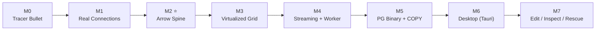

# Roadmap

> [!abstract] กฎการเดิน
> ทุก milestone = **vertical slice** ที่รันได้จริง แตะครบ 4 ชั้นบางๆ จบที่ demo คลิกได้เสมอ **อย่าสร้าง layer แนวนอนให้เสร็จก่อน**

## milestone ทั้งหมด

| # | ชื่อ | เป้าหลัก | สถานะ |
|---|---|---|---|
| [[M0 - Tracer Bullet]] | Tracer Bullet | พิมพ์ SQL ใน browser เห็นแถวจาก SQLite | ⬜ |
| [[M1 - Real Connections]] | Real Connections | Postgres + pool + catalog tree | ⬜ |
| [[M2 - Arrow Spine]] ⭐ | Arrow Spine | เปลี่ยน JSON → Arrow IPC ทั้งระบบ | ⬜ |
| [[M3 - Virtualized Grid]] | Virtualized Grid | 100k แถวลื่น (DOM virtualization) | ⬜ |
| [[M4 - Streaming and Worker]] | Streaming + Worker | 1M rows p95 < 100ms | ⬜ |
| [[M5 - PG Binary and COPY]] | PG Binary + COPY | ≥ 200 MB/s | ⬜ |
| [[M6 - Desktop Shell (Tauri)]] | Desktop (Tauri) | ร่างเร็วสุด native sockets | ⬜ |
| [[M7 - Edit, Inspect, Rescue]] | Edit / Inspect / Rescue | edit, hex inspector, snapshot/rescue | ⬜ |

> [!tip] หลัง M0
> M0 ทำให้ skeleton "มีชีวิต" ครบทุกชั้น แล้ว M1–M7 ที่เหลือคือการ **สลับชิ้นส่วนเร็วเข้าไปแทน** ทีละชิ้นโดยที่ของยังรันได้ตลอด

ดูกฎรวมที่ [[Iron Rules]] · กลับ [[Home]]
