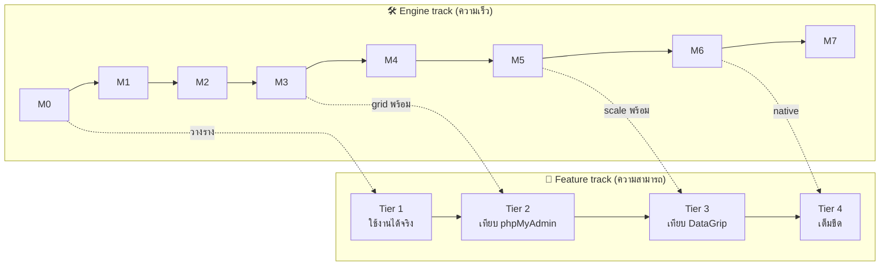

# Feature Roadmap — ทำฟีเจอร์อันไหนก่อน

> [!abstract] ปัญหาที่โน้ตนี้แก้
> มี 12 epic, ฟีเจอร์เป็นร้อย ทำพร้อมกันไม่ได้ โน้ตนี้จัดเป็น **4 tier** + บอกว่าฟีเจอร์ไหน "ทำได้เลยไม่เสียของ" กับฟีเจอร์ไหน "ต้องรอ engine" เพื่อไม่ให้เขียนซ้ำ

## หลักการสานสองแทร็ก (สำคัญสุด)

> [!danger] อย่าทำ grid ฟีเจอร์เยอะก่อน [[M2 - Arrow Spine]]
> M2 จะ refactor ทั้งระบบจาก JSON → Arrow ถ้าคุณไปทำ filter/edit/FK-nav บน `<table>` JSON ก่อน คุณจะ **รื้อทิ้งทำใหม่หมด** → control-plane features (catalog, editor, DDL, users) ทำก่อนได้เลยเพราะ Arrow ไม่แตะ · data-plane grid features รอ M2/M3 ก่อนค่อยถม

## Tier 1 — "ใช้งานได้จริง" (MVP ที่ dogfood ตัวเองได้)
> [!goal] เป้า: เปิด DataM → ต่อ DB → เห็น tree → พิมพ์ SQL → เห็นผล → แก้ค่าได้ จบ loop เดียว
> เกาะไปกับ [[M0 - Tracer Bullet]] → [[M3 - Virtualized Grid]]

- [ ] [[F01 - Connections and Data Sources]]: ต่อ SQLite + Postgres, จำ connection #t1
- [ ] [[F02 - Object Explorer]]: tree schema/table/column คลิกเปิด query #t1
- [ ] [[F03 - SQL Editor]]: textarea+run, multi-statement, query history #t1
- [ ] [[F04 - Result Grid]]: virtualized read, sort, copy cell #t1
- [ ] [[F05 - Data Editing and Transactions]]: edit cell + commit เดี่ยว #t1
- [ ] [[F07 - Import and Export]]: export CSV ของผลลัพธ์ #t1

## Tier 2 — "เทียบชั้น phpMyAdmin" (admin + CRUD ครบ)
> [!goal] เป้า: ทำงาน DBA รายวันได้ครบโดยไม่ต้องเปิด phpMyAdmin
> ต้องการ grid จาก [[M3 - Virtualized Grid]] พร้อมแล้ว

- [ ] [[F04 - Result Grid]]: per-column filter, อ่านได้ทั้ง single-row view #t2
- [ ] [[F05 - Data Editing and Transactions]]: add/clone/delete row, diff preview, FK dropdown #t2
- [ ] [[F06 - Schema and DDL Management]]: visual table/column/index/FK editor, view/proc/trigger #t2
- [ ] [[F07 - Import and Export]]: import SQL dump + CSV, export SQL/JSON/Excel, partial export #t2
- [ ] [[F09 - Search and Navigation]]: search data ทั้ง table/db #t2
- [ ] [[F10 - Admin and Server]]: users/privileges UI, process list + kill, server status #t2
- [ ] [[F11 - Productivity and Safety]]: bookmark, safe-mode confirm, read-only source #t2

## Tier 3 — "เทียบชั้น DataGrip" (สมองของ editor + visual)
> [!goal] เป้า: ฉลาดเท่า IDE — autocomplete รู้ schema, refactor, ER diagram, diff
> ได้ผลดีหลัง [[M5 - PG Binary and COPY]] (scale + type fidelity พร้อม)

- [ ] [[F03 - SQL Editor]]: schema-aware autocomplete, error squiggle, format, live template #t3
- [ ] [[F08 - Visual Tools]]: ER diagram, visual query builder (QBE), explain-plan visualizer, charts #t3
- [ ] [[F08 - Visual Tools]]: schema diff + data diff #t3
- [ ] [[F09 - Search and Navigation]]: find-in-database, go-to-definition, command palette #t3
- [ ] [[F11 - Productivity and Safety]]: change tracking/versioning, data-source coloring/grouping, local history #t3
- [ ] [[F03 - SQL Editor]]: refactor (rename propagation, safe delete) #t3

## Tier 4 — "เต็มขีด" (รีดความเร็ว + desktop superpowers)
> [!goal] เป้า: เร็วกว่าใครในตลาด + ทำสิ่งที่ web client ทำไม่ได้
> = [[M4 - Streaming and Worker]] + [[M5 - PG Binary and COPY]] + [[M6 - Desktop Shell (Tauri)]] + [[M7 - Edit, Inspect, Rescue]]

- [ ] [[F04 - Result Grid]]: canvas/WebGL2 grid (escape hatch ความหนาแน่นสุดขีด) #t4
- [ ] [[F07 - Import and Export]]: streaming export 1GB+, partition-parallel COPY #t4
- [ ] [[F12 - Desktop Superpowers]]: mmap snapshot/time-travel, WAL/journal rescue 🖥️ #t4
- [ ] [[F12 - Desktop Superpowers]]: OS keychain, native file dialog, Tauri custom protocol (Arrow ดิบ) 🖥️ #t4

## ลำดับลงมือจริง (อ่านอันนี้ถ้าจะเริ่มพรุ่งนี้)
> [!tip]
> 1. ทำ [[M0 - Tracer Bullet]] ให้จบก่อน (โค้ดยังว่าง — เริ่มที่ `Cargo.toml`) ดู [[Start Here - This Week]]
> 2. ระหว่าง M1–M3 ถม Tier 1 ลงไปบน skeleton ที่มีชีวิตแล้ว
> 3. control-plane features (F01,F02,F03-editor,F06,F10) ทำแทรกได้ทุกเมื่อ ไม่ต้องรอ engine
> 4. grid-features (F04,F05) รอผ่าน [[M2 - Arrow Spine]] ก่อนเสมอ

กลับ [[Home]] · [[Feature Catalog]] · [[Roadmap]] (engine track)
